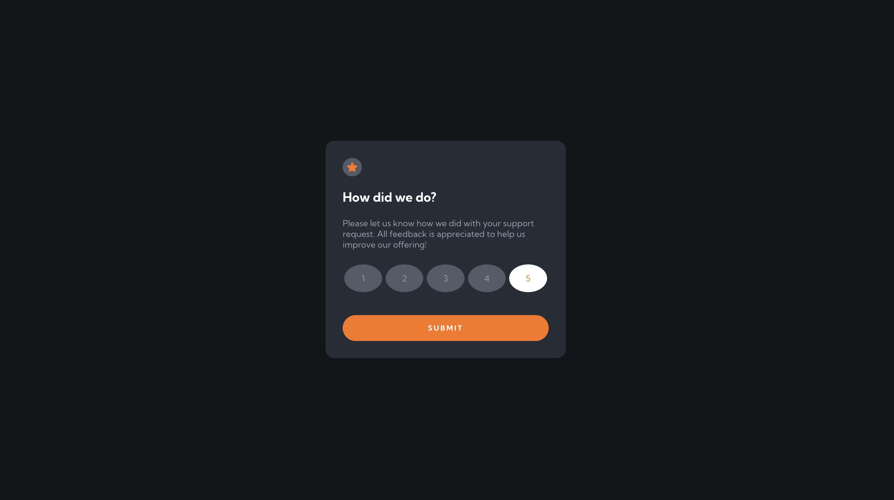

# Frontend Mentor - Interactive rating component

This is a solution to the [Interactive rating component challenge on Frontend Mentor](https://www.frontendmentor.io/challenges/interactive-rating-component-koxpeBUmI). Frontend Mentor challenges help you improve your coding skills by building realistic projects.

## Table of contents
- [The challenge](#the-challenge)
- [Screenshot](#screenshot)
 - [Links](#links)
- [Built with](#built-with)
- [What I learned](#what-i-learned)

## Overview

### The challenge

Users should be able to:

- View the optimal layout for the app depending on their device's screen size
- See hover states for all interactive elements on the page
- Select and submit a number rating
- See the "Thank you" card state after submitting a rating

### Screenshot

  
Desktop view

Desktop Thank you view

  
Mobile view

  
Mobile Thank you view

### Links

- Live Site URL: [Vercel](https://fm-interactive-rating-1wya-in9dxd3jf-cyyong95.vercel.app)

## My process

### Built with

- ReactJS
- Typescript
- CSS Module
- React Testing Library (RTL)

### What I learned
- `useState` hook
  - Allows us to add state to a function component

- CSS module
  - Classnames and animation names are locally scoped
  - Different components can be using the same class name but have different css properties
  - It is recommended to use `camelCase` to avoid facing unexpected behavior example when trying to access a `kebab-case` classname in JS

- React Testing Library
  - Allows us to import and render the component for testing
  - Important to test what user sees/interacts with on the website instead of the logic behind the components

- Typescript
  - Reduce bugs by doing static type checks when passing arguments into methods